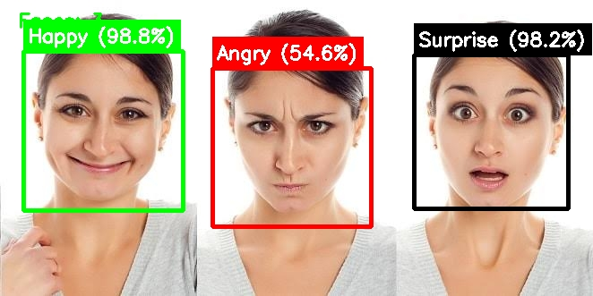

# 🙂 Facial Emotion Detection

A real-time facial emotion recognition app built with **TensorFlow/Keras**, **OpenCV**, and **Streamlit**. It detects faces in a live webcam feed or an uploaded image and classifies the emotion of each face using a trained CNN model.

---

## 📸 Demo

| input image | output image |
|---|---|
|  |  |

---

## ✨ Features

- 🎥 **Live webcam detection** — real-time face and emotion detection via `streamlit-webrtc`
- 🖼️ **Image upload mode** — detect emotions in any uploaded photo
- 👥 **Multi-face support** — detects and labels every face in the frame
- 🎨 **Color-coded labels** — each emotion is annotated with a distinct bounding box color and confidence score
- ⚡ **Cached model loading** — fast, efficient inference using Streamlit's resource caching

## 😀 Detected Emotions

The model classifies faces into **6 emotions**:

`Angry` · `Fear` · `Happy` · `Neutral` · `Sad` · `Surprise`

---

## 🛠️ Tech Stack

| Component | Technology |
|---|---|
| Web App / UI | [Streamlit](https://streamlit.io/) |
| Real-time video | [streamlit-webrtc](https://github.com/whitphx/streamlit-webrtc), `av` |
| Face detection | OpenCV Haar Cascade Classifier |
| Emotion classification | TensorFlow / Keras CNN |
| Image processing | OpenCV, NumPy |
| Model development | Jupyter Notebooks (`preprocessing.ipynb`, `model_main.ipynb`, `live_main.ipynb`) |

---

## 📁 Project Structure

```
facial_emotion_detection_project/
├── app.py                     # Streamlit application (main entry point)
├── preprocessing.ipynb        # Data cleaning & preprocessing pipeline
├── model_main.ipynb           # Model architecture, training & evaluation
├── live_main.ipynb            # Live/real-time inference experiments
├── requirement.txt            # Project dependencies
├── test_emotion_images.jpg    # Sample output image
├── test_emotion_images2.jpg   # Sample output image
├── emotion_model.keras        # Trained model (generate via model_main.ipynb)
└── README.md
```

> **Note:** `emotion_model.keras` is loaded by `app.py` but is not included in the repo. Train it using `model_main.ipynb` (or add your own trained model) and place it in the project root before running the app.

---

## 🚀 Getting Started

### Prerequisites

- Python 3.10+
- A webcam (for live detection mode)

### 1. Clone the repository

```bash
git clone https://github.com/bharatsolanki0000/facial_emotion_detection_project.git
cd facial_emotion_detection_project
```

### 2. Create a virtual environment (recommended)

```bash
python -m venv venv
source venv/bin/activate        # On Windows: venv\Scripts\activate
```

### 3. Install dependencies

```bash
pip install -r requirements.txt
```

### 4. Train / add the model

Run through `preprocessing.ipynb` and `model_main.ipynb` to train the CNN and export `emotion_model.keras` into the project root. (Alternatively, drop in your own pre-trained `.keras` model with the same 48×48 grayscale input and 6-class output.)

### 5. Run the app

```bash
streamlit run app.py
```

The app will open in your browser at `http://localhost:8501`.

---

## ☁️ Deploy on Streamlit Community Cloud

1. Push this repository to GitHub.
2. Make sure these files are in the repo root:
  - `app.py`
  - `requirements.txt`
  - `runtime.txt`
  - `packages.txt`
  - `emotion_model.keras`
3. Open Streamlit Community Cloud and create a new app from this repository.
4. Set the main file path to `app.py`.
5. Deploy the app.

If deployment fails with a TensorFlow install error, keep `runtime.txt` pinned to Python 3.11 so Streamlit Cloud does not choose a newer Python version that TensorFlow does not support.

---

## 🎮 Usage

1. Launch the app with `streamlit run app.py`.
2. Choose an input mode:
   - **Live Webcam** — click **Start** and grant camera permissions for real-time detection.
   - **Upload Image** — upload a `.jpg`, `.jpeg`, or `.png` photo to analyze.
3. Detected faces are outlined with a color-coded box showing the predicted emotion and confidence percentage.

---

## 🧠 Model Details

- **Input:** 48×48 grayscale face crop
- **Face detection:** OpenCV Haar Cascade (`haarcascade_frontalface_default.xml`)
- **Output:** Softmax probabilities over 6 emotion classes
- **Training notebooks:**
  - `preprocessing.ipynb` — dataset loading & preprocessing
  - `model_main.ipynb` — CNN architecture, training, and evaluation
  - `live_main.ipynb` — real-time inference testing


---

## 👤 Author

**Bharat Solanki**
🇮🇳 Made in Bharat

- GitHub: [@bharatsolanki0000](https://github.com/bharatsolanki0000)
